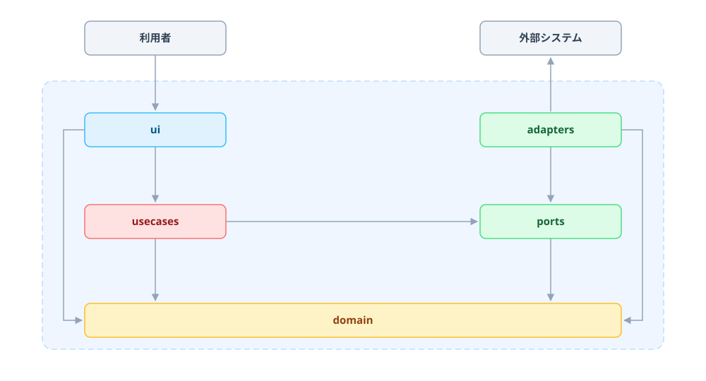

# アーキテクチャ

`flutter_mobile_app` の目標設計 (ports & adapters)。現行コードはまだこの形ではありません。

| レイヤー | 色 | 意味 |
| --- | --- | --- |
| `ui` | 青 | 相手からのアクセス (依存) に応答する側 |
| `adapters` | 緑 | こちらからアクセス (依存) する側。port の実装 |
| `usecases` | 赤 | アプリの操作単位 |
| `ports` | 緑 | usecases から見える唯一の外界。abstract interface |
| `domain` | 黄 | 型と純粋関数のみ。全レイヤーから依存される |

依存は `ui → usecases → ports` の一方向。`adapters` は port を implements するだけ (composition root が注入)。`domain` は他のどこにも依存しない。

図は `mobile-app.svg` を直接編集します (生成ツールなし)。
